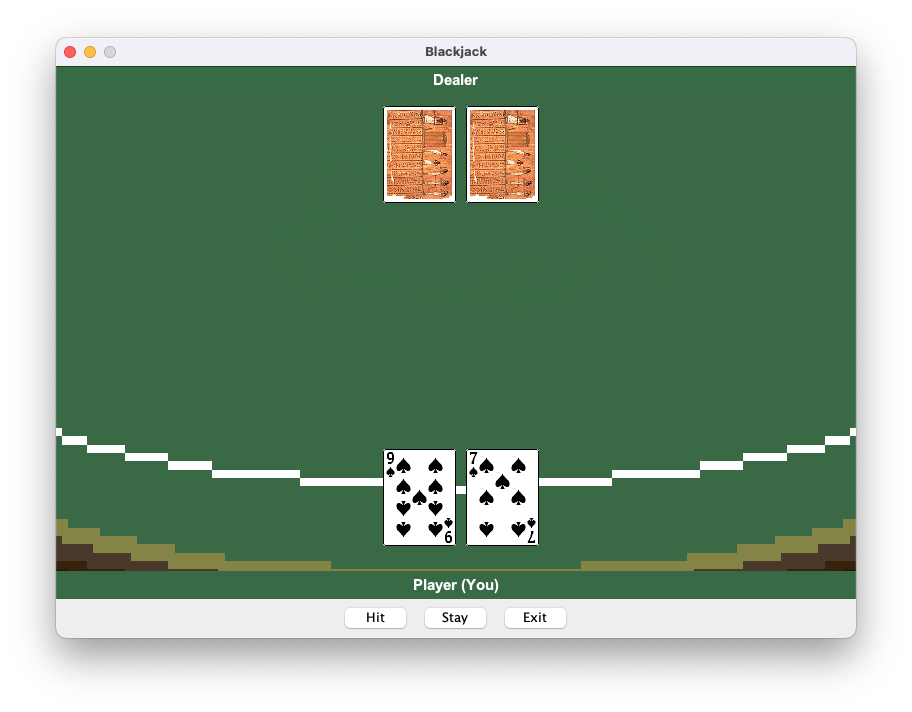

# :game_die: Addiction :slot_machine:

Addiction is a captivating role-playing game that explores the world of gambling and its consequences. In this game, you take on the role of a character navigating through a virtual casino, interacting with various gambling games and facing the challenges that come with addiction.

## :video_game: Gameplay

As you explore the casino, you'll encounter different gambling games such as Blackjack, Baccarat, and High-Low. Each game presents unique challenges and opportunities to win or lose money. Your goal is to manage your finances wisely and make strategic decisions to progress through the game.

Throughout your journey, you'll also encounter locked doors that require a fee to unlock. These doors lead to new areas of the casino, offering more gambling opportunities and challenges. Be cautious, as the temptation to spend money on unlocking doors can quickly drain your funds.

If your balance goes to 0, you will lose the game. So, be mindful of your spending and make wise choices to avoid bankruptcy.

## :sparkles: Features

- Immersive casino environment with multiple gambling games to play
- Engaging gameplay that highlights the risks and consequences of gambling addiction
- Customizable character with different sprite options
- Locked doors that require a fee to unlock, adding an extra layer of strategy and resource management
- Sound effects and background music to enhance the casino atmosphere
- Shop system to purchase items and upgrades using in-game currency
- Save and load functionality to continue your progress across multiple sessions

## :black_joker: Gamerules
1. Blackjack
   - The player and dealer receives two cards.
   - All one needs to do to win is have a higher hand value than the other, without going over 21. 
   - Player's turn starts first and are they dealt two cards. They can then choose to “hit” (receive additional cards) or “stay” (keep their current hand). 
   - Once the player stays or exceeds 21, the dealer's turn begins.
   - If a hand exceeds 21, the player/dealer “busts” and loses the game. If neither the player nor the dealer busts, the one with the highest hand value wins. Additionally, if the winner has a hand value of exactly 21, the player wins with blackjack. If both player and dealer's hands have the same value withour busting, they have a tie. 
   - Ties results in a push bet (player's bet is returned), winners will win the amount they had betted (on top of their bet being returned) and losers will lose the amount they had betted. Winners with blackjack will win twice the amount they had betted (on top of their bet being returned).
   
2. Baccarat
   - Hands are valued modulo 10, i.e., a hand consisting of 6 and 7 is worth 3.
   - Attempt to beat the dealer by getting a higher score.
   - An ace is worth 1, face cards are 0 and any other card is its pip value.
   - Naturals: If you are dealt a hand score of 8 or 9 from the start, you immediately win the game unless the dealer has the same score(tie) or higher score(you lose).
   - To 'Hit' is to ask for another card. To 'Stand' is to hold your score and end your turn.
   - A player is only allowed to hit once throughout the game.
   - Dealer stands on score 5-7 and hits otherwise.

4. High-Low
   - Game Goal:
   Guess if the next card is higher or lower than the current one. Try to get as many right in a row as possible!

   - Card Order:
   Cards go from lowest to highest: Ace, 2, 3, 4, 5, 6, 7, 8, 9, 10, Jack, Queen, King. Suits don’t matter.

   - Rules:
   Get 1 point for each correct guess.
   If the next card is the same as the current, you lose.

   - Betting:
   You need at least 3 points to start winning money.
   Winnings = your bet * (your score + 1).
   
## :computer: Installation

To run the game, follow these steps:

1. Clone the repository: `git clone https://github.com/ceewaigithub/addiction.git`
2. Navigate to the project directory: `cd addiction`
3. Compile the Java files using the provided script:
    - For Unix/Linux: `bash compile_and_run.sh` OR `bash compile.sh` & `bash run.sh`
    - For Windows: `compile_and_run.bat` OR `compile.bat` & `run.bat`
4. The game will automatically start after the compilation process.

## :joystick: Controls

- Use the ```WASD``` keys to move your character around the casino
- Press the spacebar to interact with gambling games and objects
- Follow the on-screen instructions to navigate through the game's menus and dialogues

## :clipboard: Requirements

- Java Development Kit (JDK) 8 or above

## :camera: Gameplay Images

Here are some screenshots of the gameplay:


*Title Screen - Start your addictive casino adventure!*


*Shop Screen - Purchase items and upgrades to enhance your gameplay!*


*Map - Explore different areas of the virtual casino!*


*Blackjack - Test your luck and skills in this classic card game!*


*Baccarat - Try to beat the dealer and win big!*


*High-Low - Guess if the next card is higher or lower and earn points!*

Enjoy exploring the virtual casino and experiencing the addictive gameplay!

## :clap: Credits

- Game developed by G3-T2

## :page_with_curl: License

This project is released under the MIT License.

